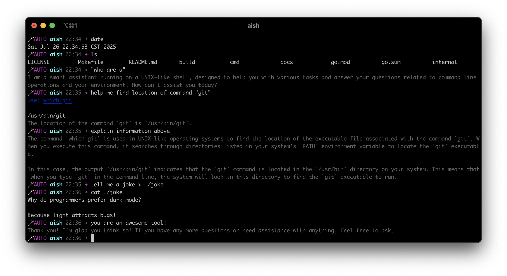
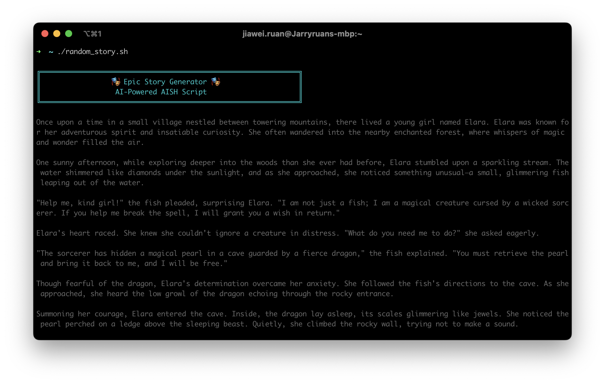

<div align="center">
  
  
  <h1 align="center">AISH</h1>
  
  <p align="center">
    <strong>An Intelligent Shell with AI-Powered Assistance</strong>
  </p>
  
  <p align="center">
    <a href="https://github.com/ruandada/aish">
      
    </a>
    <a href="LICENSE">
      
    </a>
    <a href="https://golang.org">
      
    </a>
  </p>
</div>

---

## 🚀 Overview

AISH is an intelligent shell that seamlessly combines traditional UNIX shell functionality with AI-powered assistance. It provides an enhanced command-line experience where you can use natural language to interact with your system while maintaining full compatibility with standard shell operations.

## ✨ Key Features

- **🤖 Natural Language Commands** - Execute system operations using plain English
- **💻 Full Shell Compatibility** - Complete POSIX shell support with readline and autocompletion
- **⚙️ Flexible AI Configuration** - Customize OpenAI API settings, models, and system prompts
- **🔧 Custom Tool Integration** - Extend functionality with your own local executables
- **🎨 Beautiful Interface** - Enjoy colorful, informative prompts with system information
- **📁 Workspace Support** - Project-specific configurations via `.aishrc` files

## 📦 Installation

### Prerequisites

- **OpenAI API key**
- **Go** 1.23.0 or later (if build from source)

### Option 1: Build and Install from Source (Recommended)

```bash
go install github.com/ruandada/aish/cmd/aish@latest
```

### Option 2: Donwload prebuild binaries

See [releases](https://github.com/ruandada/aish/releases)

## ⚙️ Configuration

Before using AISH, configure your OpenAI API settings:

```bash
# Create or edit your configuration file
vim ~/.aishrc
```

Add your OpenAI configuration:

```bash
# Set your OpenAI API key
aiset openai.api_key "<your-api-key>"

# Optionally customize the model (default: gpt-4o-mini)
aiset openai.model "gpt-4o-mini"

# Set custom base URL for alternative providers
aiset openai.base_url "https://api.openai.com/v1"
```

## 🎯 Quick Start

### Launch AISH

```bash
# Interactive mode
aish

# Single command execution
aish -c "what day is today?"

# Execute from script file
aish ./story.sh
```

### Basic Usage Examples

```bash
# Execute native shell commands directly
uname -a
# > Darwin macbook.local 24.0.0 Darwin Kernel Version 24.0.0: Tue Sep 24 23:39:07 PDT 2024; root:xnu-11215.1.12~1/RELEASE_ARM64_T6000 arm64

# Use natural language for AI interaction
tell me a joke
# > Why do programmers prefer dark mode?
# > Because light attracts bugs!

# Use quotes for explicit AI mode (useful when command conflicts with built-ins)
"what day is today"
# > Today is Sunday, July 27, 2025.

# Or use the "ai:" prefix for explicit AI commands
ai: what is the time
# > The current time is Sun Jul 27 10:24:29 CST 2025.
```

## 🔧 Advanced Usage

### Complex Command Patterns

```bash
# Subcommands with shell expansion
get my ip addr: $(ifconfig)
generate a report: $(df -h)

# Multi-step operations
create a new react project here && launch that project

# Piping with AI commands
"count from 1 to 100" | grep 0

# Output redirection
"generate a poem about computers" > ./poem.txt
```

### AI-Powered Shell Scripts

AISH supports full shell script syntax, allowing you to create scripts using natural language. Here's an example of a story generator script:

```bash
#!/usr/bin/env aish

# Color definitions
CYAN='\033[0;36m'
NC='\033[0m' # No Color

print_banner() {
  echo -e "${CYAN}"
  echo "╔══════════════════════════════════════════════════════════════╗"
  echo "║                 🎭 Epic Story Generator 🎭                   ║"
  echo "║                  AI-Powered AISH Script                      ║"
  echo "╚══════════════════════════════════════════════════════════════╝"
  echo -e "${NC}"
}

generate_story() {
  "tell me a random story"
}

print_banner
generate_story
```

Make it executable and run:

```bash
chmod +x ./random_story.sh
./random_story.sh
```



## 🏗️ Workspace Configuration

AISH automatically reads `.aishrc` files in the current directory, enabling project-specific configurations:

- Define custom AI tools
- Set project-specific system prompts
- Configure specialized LLM models

### Example Configurations

Explore our examples for advanced usage:

- **[Emoji Agent](docs/examples/emoji/README.md)** - Customize AI prompts to create specialized agents
- **[Custom Tools](docs/examples/tools/README.md)** - Expose local executables as AI tools

## 🎛️ Shell Modes

AISH operates in three distinct modes:

### Auto Mode (Default)

Automatically detects whether input is a shell command or AI conversation.

### AI Mode

All input is processed by the AI assistant.

```bash
# Force AI mode for single command
ai: write an essay about GitHub

# Switch to AI mode
ai:

# Direct AI interaction
write an essay about GitHub
```

### User Mode

All input is processed by the traditional shell interpreter (no AI).

```bash
# Force user mode for single command
user: ifconfig
# Shortcut
:: ifconfig

# Switch to user mode
::

# Direct shell execution
ifconfig
```

## 🛠️ Built-in Commands

### Configuration Management

| Command               | Description                      |
| --------------------- | -------------------------------- |
| `aiset <key> <value>` | Set configuration values         |
| `aiget <key>`         | Get specific configuration value |
| `aiget`               | Display all configuration values |

### System Prompt Management

| Command             | Description                     |
| ------------------- | ------------------------------- |
| `aiprompt <prompt>` | Append custom system prompts    |
| `aiprompt reset`    | Reset to default system prompts |
| `aiprompt`          | View current system prompt      |

### Mode Control

| Command                             | Description                           |
| ----------------------------------- | ------------------------------------- |
| `auto:`                             | Switch to auto mode                   |
| `ai:`                               | Switch to AI mode                     |
| `user:` or `::`                     | Switch to user mode                   |
| `auto: <command>`                   | Execute in auto mode (mode unchanged) |
| `ai: <command>`                     | Execute in AI mode (mode unchanged)   |
| `user: <command>` or `:: <command>` | Execute in user mode (mode unchanged) |

## 🧪 Development

### Building

```bash
# Build the application
make

# Test local development
go run ./cmd/aish
```

### Project Structure

```
aish/
├── cmd/aish/          # Main application entry point
├── internal/          # Core implementation
│   ├── base/         # Base shell functionality
│   └── plugins/      # AI and extension plugins
├── docs/             # Documentation and examples
└── Makefile          # Build configuration
```

## 📄 License

This project is licensed under the MIT License - see the [LICENSE](LICENSE) file for details.

## 🙏 Acknowledgments

- **Shell Engine**: Built with [mvdan.cc/sh](https://github.com/mvdan/sh) for POSIX compatibility
- **AI Integration**: Powered by OpenAI's GPT models
- **Inspiration**: Modern shell experiences and AI-assisted development tools

## ☕️ Buy Me a Coffee

If you find AISH helpful and would like to support its development, consider buying me a coffee! Your support helps keep this project alive and enables me to continue improving it.

<div align="center">
  <table>
    <tr>
      <td align="center">
        
        <p><strong>Alipay</strong></p>
      </td>
      <td align="center" style="padding-left: 20px;">
        
        <p><strong>WeChat</strong></p>
      </td>
    </tr>
  </table>
  <p><strong>Scan to donate</strong></p>
</div>

---

<div align="center">
  <p>Made with ❤️ by <a href="https://github.com/ruandada">@ruandada</a></p>
  <p>
    <a href="https://github.com/ruandada/aish/issues">Report Bug</a>
    ·
    <a href="https://github.com/ruandada/aish/issues">Request Feature</a>
    ·
    <a href="https://github.com/ruandada/aish">View on GitHub</a>
  </p>
</div>
