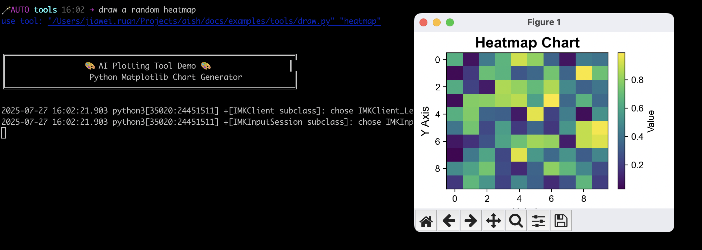

# 🔧 Custom Tools Integration Example

This example demonstrates how to expose your local executables as AI tools in AISH, allowing the AI to use your custom scripts and programs.

## 🚀 Quick Start

Run AISH in this directory:

```bash
aish
```

## ⚙️ How It Works

The `.aishrc` file in this directory is automatically read and sourced by AISH when you start the shell. In this configuration, we use the `aitool` built-in command to register local executables as AI tools.

### Available Tools

This example includes two custom tools:

| Tool                | Description                               | File       |
| ------------------- | ----------------------------------------- | ---------- |
| **Chart Generator** | Draws a random plot chart and displays it | `draw.py`  |
| **Story Generator** | Uses AISH to generate a random story      | `story.sh` |

### Configuration Details

See the [`.aishrc`](.aishrc) file for the complete configuration:

```bash
# Register custom executables as AI tools
aitool draw.py "Draw a random plot chart and show it"
aitool story.sh "Generate a random story using AISH"
```

## 🎯 Example Output

When you ask AISH to create charts or stories, it will use your custom tools:



## 🔧 Try It Out

Once you're in AISH with this configuration loaded, try commands like:

- "Draw me a chart"
- "Generate a story"
- "Create a visualization"

The AI will automatically use your registered tools to fulfill these requests!

## 📁 Files

- **`.aishrc`** - Configuration file that registers the custom tools
- **`draw.py`** - Python script that generates random charts
- **`story.sh`** - Shell script that generates stories using AISH
- **`draw.png`** - Screenshot showing the custom tools in action
- **`README.md`** - This documentation file

## 🛠️ Tool Details

### `draw.py`

A Python script that creates random matplotlib charts and displays them. The AI can use this to generate various types of visualizations.

### `story.sh`

A shell script that leverages AISH's natural language capabilities to generate creative stories. This demonstrates how AISH can use its own features through custom tools.

---

<div align="center">
  <p><em>Extend AISH's capabilities with your own custom tools!</em></p>
</div>
